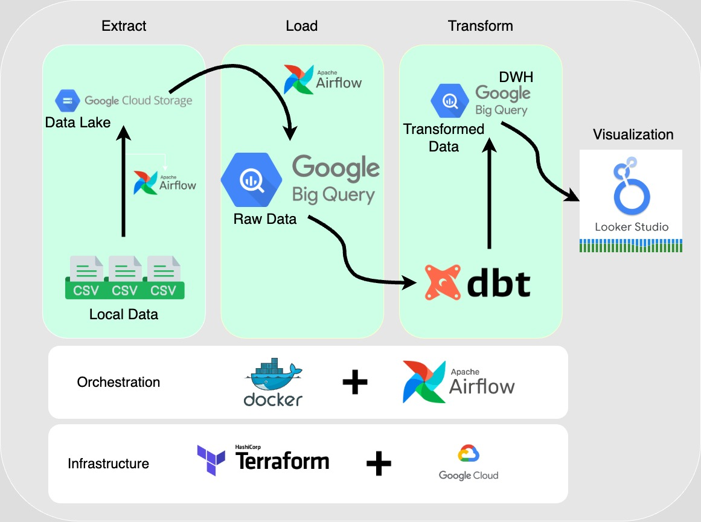

# Formula 1 Data Pipeline and Performance Dashboard

## Objective
The goal of this project is to apply the concepts learned in the [Data Engineering Zoomcamp](https://github.com/DataTalksClub/data-engineering-zoomcamp) to build an end-to-end data pipeline, from data ingestion to visualization. This project processes Formula 1 data, stores it in a data lake, transforms it in a data warehouse, and visualizes key insights in a dashboard.

## Problem Description
This project aims to analyze Formula 1 racing data to uncover performance insights for teams (constructors) and drivers. The problem is to create a pipeline that:
1. Ingests raw Formula 1 data (e.g., race results, pit stops) into a data lake.
2. Moves the data into a data warehouse for efficient querying.
3. Transforms the data to prepare it for analysis (e.g., calculating pit stop efficiency, driver standings).
4. Visualizes the transformed data in a dashboard with at least two tiles for stakeholders unfamiliar with Formula 1.

The dashboard helps answer questions like: Which teams have the fastest pit stops? Who are the top-performing drivers and teams each season? This is useful for fans, analysts, or team strategists looking to understand performance trends.

## Dataset
The dataset used is the [Formula 1 World Championship (1950–2023)](https://www.kaggle.com/datasets/rohanrao/formula-1-world-championship-1950-2020) from Kaggle. It includes CSV files such as `races.csv`, `results.csv`, `pit_stops.csv`, and `drivers.csv`, covering races, pit stops, driver standings, and more. The `data/` directory in this repo contains these files.

## Data Pipeline Overview
This project uses a **batch pipeline** (not stream) to process the data periodically. Here’s the flow:
1. **Data Lake**: Raw CSV files are uploaded to Google Cloud Storage (GCS) using Airflow.
2. **Data Warehouse**: Data is loaded from GCS to Google BigQuery using Airflow.
3. **Transformations**: dbt (Data Build Tool) transforms the raw data into optimized tables **Partitioned and clustered** and creates analysis-ready marts.
4. **Visualization**: A Looker Studio dashboard visualizes the transformed data with two tiles.

### Pipeline Diagram
The following diagram illustrates the ETL stages of the pipeline and the tools used at each step:



### Technologies Used
- **Cloud**: Google Cloud Platform (GCP) for storage and data warehousing.
- **Infrastructure as Code (IaC)**: Terraform to provision GCS buckets and BigQuery datasets.
- **Workflow Orchestration**: Apache Airflow to automate the batch pipeline.
- **Data Warehouse**: Google BigQuery for storing and querying data.
- **Transformations**: dbt for data modeling and transformations.
- **Dashboard**: Looker Studio (Google Data Studio) for visualization.

#### Tool Explanations
- **Terraform**: An IaC tool to define and provision cloud infrastructure (e.g., GCS bucket, BigQuery dataset) using code, ensuring reproducibility.
- **Apache Airflow**: A workflow orchestration tool to schedule and manage the pipeline steps (e.g., uploading to GCS, loading to BigQuery).
- **dbt (Data Build Tool)**: A tool for transforming data in the warehouse using SQL models, with features like testing and documentation.
- **Looker Studio**: A free BI tool by Google to create interactive dashboards connected to BigQuery.

## Cloud
The project is fully developed in Google Cloud Platform (GCP):
- **GCS**: Stores raw Formula 1 data in a bucket (`<your-project-id>-f1-data-bucket`).
- **BigQuery**: Hosts the data warehouse with datasets `f1_data` (raw) and `f1_data_optimized` (transformed).
- **Terraform**: Provisions the GCS bucket and BigQuery dataset using IaC (see `terraform/` directory).

## Data Ingestion - Batch / Workflow Orchestration
This is a batch pipeline, orchestrated end-to-end with Apache Airflow:
- **DAGs**:
  - `upload_to_gcs.py`: Uploads CSV files from `data/` to GCS.
  - `gcs_to_bigquery_f1.py`: Loads data from GCS to BigQuery (`f1_data` dataset).
- **Steps**:
  1. Upload raw CSVs to GCS.
  2. Load CSVs into BigQuery tables.
  3. Trigger dbt transformations (manual in this setup, but can be added to Airflow).
- The pipeline is fully automated via Airflow DAGs (see `dags/`).

## Data Warehouse
Google BigQuery is used as the data warehouse:
- **Datasets**:
  - `f1_data`: Raw tables loaded from GCS (e.g., `circuits`, `races`, `pit_stops`).
  - `f1_data_optimized`: Transformed tables created by dbt.
- **Optimization**:
  - Tables in `f1_data_optimized` (e.g., `opt_pit_stops`, `opt_results`) are partitioned by `date` and clustered by relevant fields (e.g., `driverId`, `constructorId`).
  - Example: `opt_pit_stops` is partitioned by `date` and clustered by `driverId, constructorId` to optimize queries for pit stop analysis.
  - This reduces query costs and speeds up dashboard queries (e.g., aggregations by date or constructor).

## Transformations
Transformations are performed using dbt:
- **Models**:
  - `optimized`: Optimized raw tables with partitioning and clustering (e.g., `opt_pit_stops.sql`).
  - `staging`: Cleaned views with renamed columns (e.g., `stg_pit_stops.sql`).
  - `marts`: Analysis-ready tables (e.g., `pit_stop_efficiency.sql`, `driver_standings_by_season.sql`).
- **Process**:
  - dbt creates 14 `opt_*` tables, 5 `stg_*` views, and 4 marts tables (`pit_stop_efficiency`, `constructor_performance`, `driver_standings_by_season`, `fastest_laps_by_circuit`).
  - Includes tests (e.g., `not_null`, `unique`) and documentation (see `dbt/`).
- **Why dbt?**: dbt allows modular SQL transformations, dependency management, and testing, ensuring data quality.

## Dashboard
A Looker Studio dashboard visualizes the transformed data with three tiles (exceeding the minimum of two):
- **Link**: [Formula 1 Performance Dashboard](https://lookerstudio.google.com/s/iM4kEMcbqqs)
- **Tiles**:
  1. **Constructor Performance by Season** (Categorical Distribution):
     - A bar chart showing total points (`total_points`) for top constructors (`constructor_name`) in a selected season (`season`).
     - Includes a season drop-down to pick the year.
     - Explains constructors and points: higher points mean better performance.
  2. **Top Formula 1 Drivers by Season** (Categorical Distribution):
     - A leaderboard table showing the top 5 drivers in a selected season, with their points, wins, podiums, and rank.
     - Uses color-coding (gold, silver, bronze) for the top 3 ranks.
     - Explains driver standings: more points mean a higher chance of being the champion.

The dashboard is designed for people unfamiliar with Formula 1, with clear titles, descriptions, and interactivity.

## Project Structure
- `data/`: Raw Formula 1 CSV files.
- `dags/`: Airflow DAGs (`upload_to_gcs.py`, `gcs_to_bigquery_f1.py`).
- `dbt/`: dbt project with models, tests, and docs.
- `terraform/`: Terraform scripts (`main.tf`, `variables.tf`).
- `docker-compose.yaml`: Airflow setup.
- `requirements.txt`: Python dependencies.

## Prerequisites
- Google Cloud account with a project (e.g., `your-project-id`).
- Google Cloud SDK installed (`gcloud` CLI).
- Docker and Docker Compose installed.
- Python 3.8+ and `virtualenv`.
- dbt installed (`pip install dbt-bigquery`).
- Terraform installed.

## Setup Instructions

### 1. Clone the Repository
```bash
    git clone git@github.com:armoustafa/f1-data-pipeline.git
    cd f1-data-pipeline
```
### 2. Set Up Google Cloud Credentials
- Create a service account in Google Cloud with permissions for GCS and BigQuery (e.g., Storage Admin, BigQuery Admin).
- Download the service account JSON key (e.g., `your-service-account-key.json`).
- Place the JSON key in the project root (e.g., `f1-data-pipeline/your-service-account-key.json`).
- Set the environment variable:
  ```bash
  export GOOGLE_APPLICATION_CREDENTIALS="f1-data-pipelineyour-service-account-key.json"
### 3. Set Up Terraform
- Update `terraform/terraform.tfvars` with your project details (create this file if it doesn’t exist):
  ```hcl
  project     = "your-project-id"
  region      = "us-central1"
  credentials = "/path/to/your-service-account-key.json"
- Initialize and apply Terraform:
 ```bash
    cd terraform
    terraform init
    terraform apply
```
This creates a GCS bucket (`your-project-id-f1-data-bucket`) and BigQuery dataset (`f1_data`).

 ### 4. Set Up Virtual Environment
 ```
    python3 -m venv venv
    source venv/bin/activate
    pip install -r requirements.txt
 ```
 ### 5. Run Airflow to Load Data
  1. Start Airflow: `docker-compose up -d`
  2. Access the Airflow UI at `http://localhost:8080` (default login: `airflow`/`airflow`).
  3. Enable and run the `upload_to_gcs` DAG to upload `data/` to GCS.
  4. Enable and run the `gcs_to_bigquery_f1` DAG to load data from GCS to BigQuery (`f1_data` dataset).
 ### 6. Run dbt Pipeline
 1. Set up dbt profile in `~/.dbt/profiles.yml`:
 ```yaml
    f1_dbt:
    target: dev
    outputs:
        dev:
        type: bigquery
        method: service-account
        project: your-project-id
        dataset: f1_data_optimized
        threads: 1
        keyfile: /path/to/your-service-account-key.json
```
2. Run the dbt pipeline:
```bash
    cd dbt
    dbt run --full-refresh
    dbt test
    dbt docs generate
    dbt docs serve
```
### 7. View the Dashboard
- The Looker Studio dashboard uses the marts tables (constructor_performance, driver_standings_by_season).
- Access it via the link above.
## Notes
- Ensure your service account has the necessary permissions (e.g., `Storage Admin`, `BigQuery Admin`).
- The dashboard is publicly accessible.